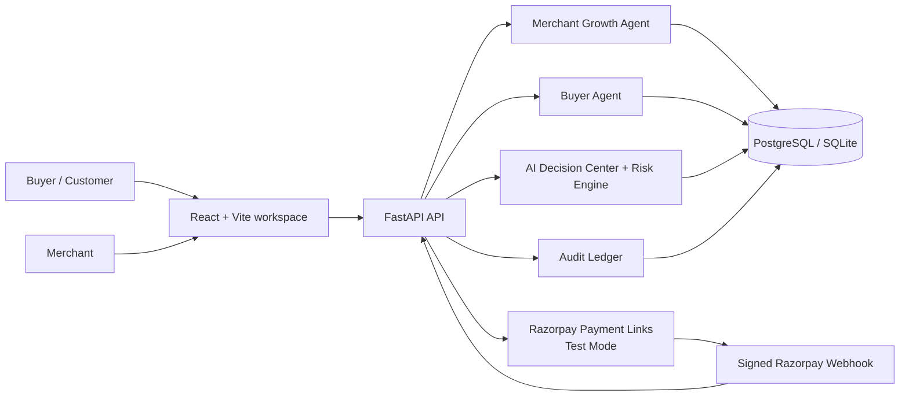
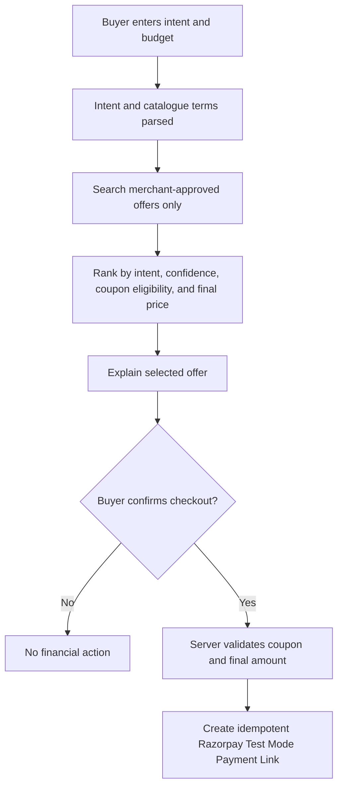
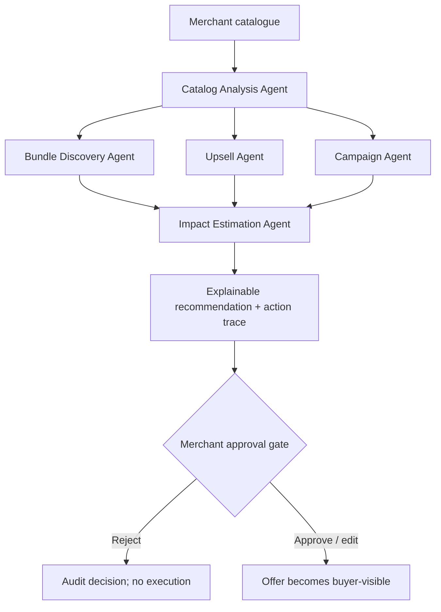
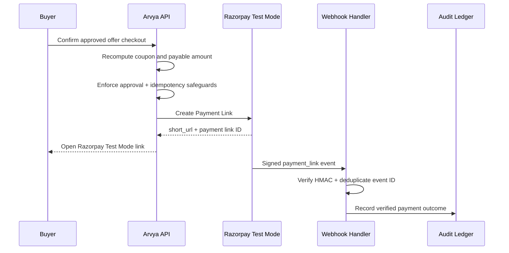
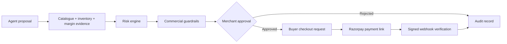
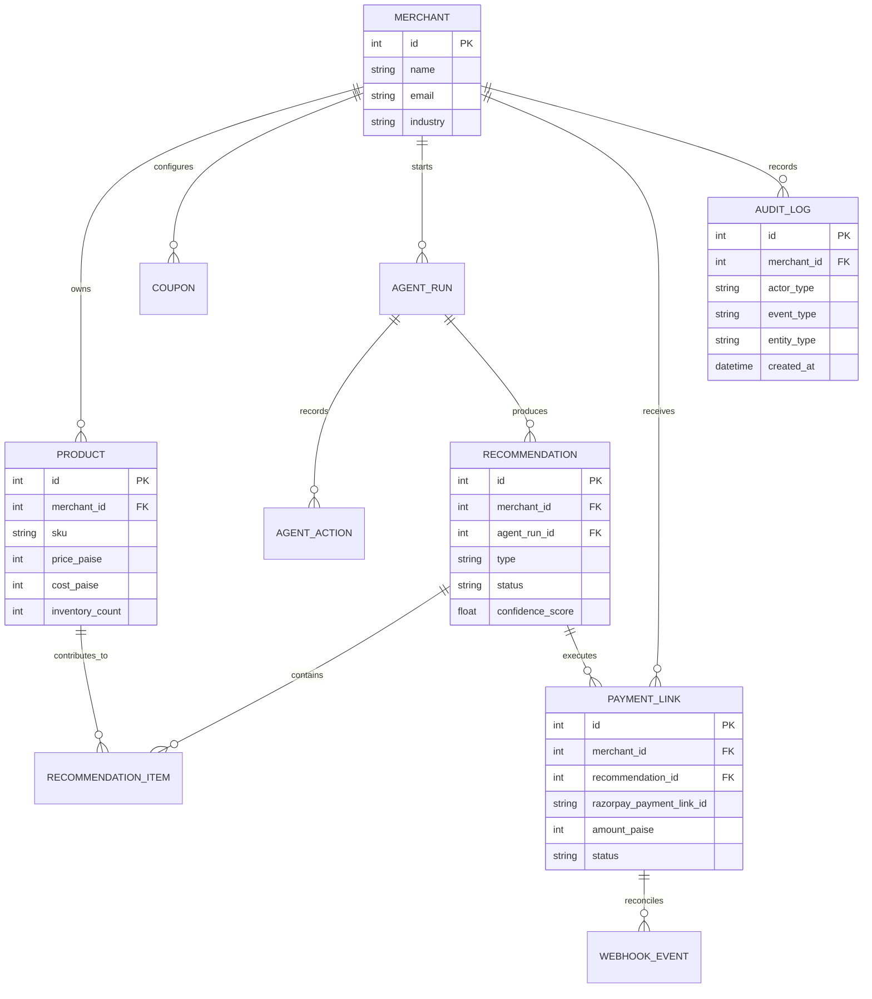

# Arvya

<p align="center">
  <strong>Where AI Buyers Meet AI Merchants.</strong><br />
  Governed agentic commerce for merchant growth, buyer trust, and verifiable payments.
</p>

<p align="center">
  <a href="https://arvya-growth-agent.onrender.com"></a>
  
  
  
  
</p>

<p align="center">
  <!-- Replace this placeholder with a polished Arvya product banner before submission. -->
  
</p>

> **Buildathon thesis:** AI should make commerce more intelligent without making money movement less accountable. Arvya separates recommendation from execution: agents can propose, humans approve, and Razorpay verifies the payment outcome.

## The problem

Modern commerce has two gaps:

1. **Buyers** face too many products, inconsistent offers, and little explanation of why an option is appropriate.
2. **Merchants** have rich catalogue data but lack an accountable way to convert it into bundles, upsells, campaigns, and offers—without damaging margin, inventory, or brand trust.

Most AI commerce experiences stop at a chat response. They do not provide commercial controls, approval workflows, payment verification, or a durable decision record.

## The solution

**Arvya is a governed agentic commerce platform.** Buyer-facing and merchant-facing agents collaborate through a shared trust layer:

- The **Buyer Agent** discovers and compares only merchant-approved offers, applies eligible coupons, explains the recommendation, and prepares a checkout request.
- The **Merchant Growth Agent** inspects catalogue context, creates bundle/upsell/campaign recommendations, and estimates directional business impact.
- The **Governance Layer** applies risk checks, commercial guardrails, merchant approval gates, audit logging, and Razorpay payment reconciliation.

The result is not a generic chatbot. It is a controlled commerce operating layer from catalogue insight to verified payment.

## Key capabilities

| Capability | What Arvya does |
|---|---|
| **Buyer Agent** | Understands intent, discovers approved offers, compares final price, applies eligible merchant coupons, explains why an offer fits, and creates a checkout request. |
| **Merchant Growth Agent** | Analyses catalogues, discovers bundles and upsells, drafts campaign opportunities, estimates uplift, and records specialist-agent actions. |
| **AI Decision Center** | Makes reasoning inspectable with confidence components, risk score, selected/rejected reasoning, expected lift, guardrails, and audit references. |
| **Human control** | Merchants approve, edit, or reject commercial recommendations before they become customer-visible or payment-enabled. |
| **Razorpay payments** | Creates Razorpay Test Mode Payment Links, supports safe retry/idempotency, and reconciles final status through signed webhooks. |
| **Auditability** | Records the actor, entity, timestamp, and detail for merchant, agent, customer, simulation, and Razorpay events. |
| **Safe commerce simulation** | Demonstrates the complete governed loop in seconds without creating a live payment request or claiming simulated revenue as real. |

## Architecture overview

### System architecture



### Buyer Agent flow



### Merchant Agent flow



### Payment flow



### Governance flow



## AI decision making

Arvya makes the decision trace visible rather than asking a merchant or buyer to trust a black box.

### Why selected

The Decision Center displays the evidence behind a chosen offer, including:

- catalogue and category fit,
- product availability,
- post-discount margin,
- coupon eligibility and final payable price,
- merchant approval status, and
- recorded specialist-agent actions.

### Why rejected

Offers are not admitted to checkout when they fail transparent commercial policy, for example:

- post-discount margin below the guardrail,
- out-of-stock or low-stock products,
- invalid/ineligible coupons,
- missing merchant approval, or
- price/budget constraints.

### Confidence and risk

The current decision engine derives confidence from inspectable, deterministic components:

```text
35% intent relevance
+ 25% margin safety
+ 20% inventory confidence
+ 10% coupon eligibility
+ 10% catalogue data quality
```

Risk is assessed separately. This is important: a high-confidence recommendation cannot bypass a blocking margin, inventory, coupon, or approval rule.

### AI model posture

The buildathon implementation intentionally keeps commercial decisions reproducible with **catalogue-grounded deterministic specialist workflows**. Agent-run records already persist model-provider and prompt-version metadata, so an OpenAI- or Claude-compatible structured explanation/narration layer can be added without giving an LLM authority over approval, pricing, or payment execution.

## AI Decision Center

The **AI Decision Center** is Arvya's judge-facing trust surface. It presents:

- selected recommendation and offer economics,
- confidence component scores and formula,
- risk score with reasons,
- merchant approval state,
- commercial guardrails,
- why selected / why alternatives are excluded,
- agent reasoning timeline,
- impact assumptions, evidence sources, and audit IDs.

## Commerce Simulation

`Run Full Commerce Simulation` compresses the product story into a transparent 13-event trace:

1. Customer intent received
2. Buyer Agent activated
3. Catalogue analysis
4. Offer discovery
5. Merchant Agent evaluation
6. Bundle opportunity found
7. Coupon applied
8. Risk check
9. Approval gate
10. Payment-link step
11. Payment-completion step
12. Revenue-recording step
13. Audit-ledger update

> Simulation mode is explicitly safe: payment-link creation, payment completion, and revenue entries are marked as **simulated**. It never calls Razorpay, captures money, or changes real revenue. In the live flow, those actions require approval and a signed Razorpay webhook.

## Screenshots

> Replace these placeholders with screenshots or a short GIF before final submission.

| Merchant workspace | AI Decision Center |
|---|---|
|  |  |

| Buyer Agent | Razorpay Payment Operations |
|---|---|
|  |  |

## Technology stack

| Layer | Technology | Responsibility |
|---|---|---|
| Frontend | React, Vite, TypeScript | Merchant workspace, Buyer Agent, simulation, Decision Center |
| Styling | Tailwind CSS | Responsive Razorpay-inspired UI, light/dark workspace support |
| Backend | FastAPI, Python | API, policy enforcement, payments, audit, webhook handling |
| Database | PostgreSQL in deployment; SQLite locally | Merchants, catalogues, recommendations, payment links, audit data |
| Agent layer | Policy-grounded specialist workflows; LLM-compatible architecture | Catalogue analysis, bundle, upsell, campaign, impact, explanation |
| Payments | Razorpay Payment Links, Test Mode | Buyer checkout, payment-link lifecycle, webhook reconciliation |
| Deployment | Render | FastAPI web service, PostgreSQL, static React frontend |

## Project structure

```text
Arvya/
├── backend/
│   ├── app/
│   │   ├── api/v1/
│   │   │   ├── auth.py                 # Demo merchant auth
│   │   │   ├── catalog.py              # Catalogue APIs and CSV import
│   │   │   ├── recommendations.py      # Growth-agent runs and approvals
│   │   │   ├── decision_center.py      # Decision Center + simulation APIs
│   │   │   ├── shopping.py             # Buyer Agent and checkout APIs
│   │   │   ├── audit.py                # Audit ledger API
│   │   │   └── webhooks.py             # Razorpay webhook endpoint
│   │   ├── core/                       # Configuration and JWT security
│   │   ├── db/models/                  # SQLAlchemy data model
│   │   ├── integrations/razorpay/      # Razorpay Payment Link client
│   │   ├── schemas/                    # Request and response contracts
│   │   ├── scripts/seed_demo_data.py   # Seed merchants and catalogues
│   │   ├── services/                   # Agents, policy, payment, audit logic
│   │   └── main.py                     # FastAPI application
│   ├── Dockerfile
│   └── requirements.txt
├── frontend/
│   ├── src/
│   │   ├── api/                        # Typed API clients
│   │   ├── components/                 # Reusable UI components
│   │   ├── pages/                      # Dashboard, Buyer Agent, Decision Center
│   │   ├── styles/                     # Tailwind and theme layer
│   │   ├── types/                      # Shared TypeScript types
│   │   └── App.tsx
│   ├── package.json
│   └── vite.config.ts
├── docs/
│   ├── ARCHITECTURE.md
│   ├── DEMO_SCRIPT.md
│   ├── DEPLOYMENT.md
│   └── SUBMISSION.md
├── render.yaml
└── README.md
```

## API architecture

All API routes are prefixed with `/api/v1` unless noted otherwise.

| Area | Routes | Access |
|---|---|---|
| Health | `GET /health` | Public |
| Demo auth | `GET /auth/merchants`, `POST /auth/login`, `GET /auth/me` | Public / merchant JWT |
| Catalogue | `GET /catalog/products`, `POST /catalog/products`, `POST /catalog/upload`, `GET /catalog/summary` | Merchant JWT |
| Dashboard | `GET /dashboard/overview`, `GET /dashboard/recent-activity` | Merchant JWT |
| Growth Agent | `POST /agent-runs`, `GET /agent-runs/{id}`, `GET /agent-actions` | Merchant JWT |
| Recommendations | `GET /recommendations`, `GET /recommendations/{id}`, `POST /recommendations/{id}/approve`, `POST /recommendations/{id}/reject` | Merchant JWT |
| Decision Center | `GET /decision-center`, `POST /commerce-simulations` | Merchant JWT |
| Buyer Agent | `POST /shopping/search`, `POST /shopping/offers/{id}/checkout` | Public buyer flow |
| Payment operations | `GET /payment-links`, `POST /payment-links/{id}/retry` | Merchant JWT |
| Audit ledger | `GET /audit-logs` | Merchant JWT |
| Razorpay webhook | `GET/POST /webhooks/razorpay` | Public readiness / signed POST only |

## Database design



## Security and governance

| Control | How it works |
|---|---|
| **Human approval** | Recommendations remain pending until a merchant approves, edits, or rejects them. Buyer checkout is restricted to approved offers. |
| **Commercial guardrails** | Offer price cannot exceed the original catalogue total; decision checks expose post-discount margin, stock, coupon and approval conditions. |
| **Risk engine** | Separately evaluates missing cost data, unsafe margin, low/out-of-stock inventory, and unresolved approval state. |
| **Payment safety** | Payable amount and coupon are recomputed server-side; checkout uses a per-attempt idempotency token; failed links are retryable. |
| **Webhook verification** | Razorpay webhook raw body is HMAC-verified and provider event IDs are deduplicated before local payment status changes. |
| **Audit logs** | Agent, merchant, customer, system and Razorpay events store actor, entity, timestamp and decision detail. |
| **Secret handling** | Razorpay keys and webhook secret stay in local/deployment environment variables and must never be committed. |

## Run locally

### Prerequisites

- Node.js 20+
- Python 3.11+
- Razorpay Test Mode account and API key pair for live Test Mode links

### Backend

```powershell
cd backend
python -m venv .venv
.\.venv\Scripts\Activate.ps1
pip install -r requirements.txt
Copy-Item .env.example .env
uvicorn app.main:app --reload --port 8000
```

### Frontend

```powershell
cd frontend
npm install
npm run dev
```

Open `http://localhost:5173`.

### Environment variables

Create `backend/.env` locally. This file is intentionally ignored by Git.

```env
# Local: SQLite. Deployment: Render PostgreSQL connection string.
DATABASE_URL=sqlite:///./arvya.db
JWT_SECRET=replace-with-a-long-random-value
FRONTEND_ORIGIN=http://localhost:5173

# Razorpay Test Mode only — never commit real values.
RAZORPAY_KEY_ID=rzp_test_...
RAZORPAY_KEY_SECRET=...
RAZORPAY_WEBHOOK_SECRET=your_private_webhook_secret
```

For a deployed frontend, set `VITE_API_URL` during the frontend build:

```env
VITE_API_URL=https://YOUR-API.onrender.com/api/v1
```

The backend seeds demo merchants and skincare, coffee, and fitness catalogues at first startup.

### Razorpay Test Mode webhook

The endpoint is:

```text
POST /api/v1/webhooks/razorpay
```

For localhost development:

```powershell
ngrok http 8000
```

Register `https://YOUR-NGROK-DOMAIN/api/v1/webhooks/razorpay` in Razorpay **Test Mode**, subscribe to `payment_link.paid`, `payment_link.partially_paid`, and `payment_link.cancelled`, and use the same webhook secret in Razorpay and `RAZORPAY_WEBHOOK_SECRET`.

## Future scope

Arvya is designed to expand from a governed demo into a merchant-controlled agentic commerce network:

- Marketplace/catalogue connectors: **Shopify**, Amazon, Flipkart, Meesho, and D2C storefronts.
- OpenAI- and Claude-compatible structured narration for recommendations, while policy checks remain deterministic.
- Campaign channel connectors with explicit merchant review and send approval.
- More buyer signals: delivery preference, price sensitivity, product compatibility, and repeat-purchase context.
- Advanced merchant analytics, offer experiments, and verified conversion attribution.
- Multi-merchant onboarding, role-based access control, and production-grade audit immutability.

## Why Arvya matters

Agentic commerce will change how people buy and sell. The hard problem is not simply generating a recommendation—it is making the recommendation safe to commercialize.

Arvya gives buyers clearer choices, gives merchants an AI growth layer grounded in catalogue economics, and gives payments a verifiable control point through Razorpay. It proves that agentic commerce can be useful **and** accountable.

## Demo video

> **Coming soon:** Add a 3–5 minute walkthrough showing Buyer Agent search → Merchant approval → AI Decision Center → Razorpay Test Mode payment → webhook-driven audit update.

## Team

Built by a **solo developer** for the Razorpay AI Buildathon.

## License

This project is currently shared for Razorpay AI Buildathon evaluation. Add an OSS license, such as MIT or Apache-2.0, before public open-source distribution.

---

<p align="center">
  <strong>Arvya — where AI buyers meet AI merchants, under human control.</strong>
</p>
