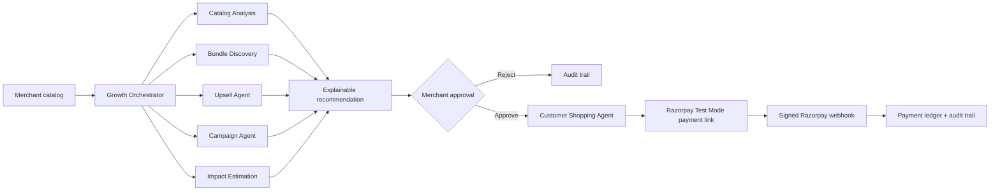

# Arvya — Governed AI Commerce for Merchant Growth

Arvya turns a merchant catalog into governed revenue opportunities. Its specialist agents propose bundles, upsells, and campaign ideas; the merchant reviews every commercial decision; customers discover only approved offers; Razorpay Test Mode completes and reconciles payment.

## Why Arvya

Merchants do not need another generic chatbot. They need an accountable system that can turn catalog data into offers while protecting their margin, brand, and customers.

- **Growth side:** catalog-aware bundle, upsell, and campaign opportunities with evidence and directional impact assumptions.
- **Commerce side:** customers compare merchant-approved offers, receive eligible coupons, and get a Razorpay payment link.
- **Trust side:** approval before execution, deterministic price validation, idempotent payment-link creation, signed webhooks, and an append-only audit history.

## Architecture



More detail: [architecture](docs/ARCHITECTURE.md) · [demo script](docs/DEMO_SCRIPT.md) · [deployment](docs/DEPLOYMENT.md) · [submission narrative](docs/SUBMISSION.md).

## What is implemented

- Multi-step, specialist-agent workflow with durable action records and a visible reasoning trace.
- Explainable recommendations: catalog signals, margin-safe price, confidence, assumptions, and expected uplift.
- Merchant approval/edit/reject controls before an offer is customer-visible or payment-enabled.
- Customer Shopping Agent across skincare, coffee, and fitness catalogs.
- Merchant coupons, server-side payable-price validation, and idempotent Razorpay payment links.
- Razorpay webhook HMAC validation, event-ID deduplication, payment reconciliation, safe retry, and payment operations dashboard.
- Light/dark workspace, payment ledger, revenue metrics, and an append-only audit timeline.

## Run locally

### Backend

```powershell
cd backend
.\.venv\Scripts\python.exe -m uvicorn app.main:app --reload --port 8000
```

Create `backend/.env` locally. Never commit this file or any real secret.

```env
DATABASE_URL=sqlite:///./arvya.db
JWT_SECRET=replace-for-production
FRONTEND_ORIGIN=http://localhost:5173
RAZORPAY_KEY_ID=rzp_test_...
RAZORPAY_KEY_SECRET=...
RAZORPAY_WEBHOOK_SECRET=your_private_webhook_secret
```

### Frontend

```powershell
cd frontend
npm.cmd install
npm.cmd run dev
```

The backend seeds demo merchants and catalog data automatically on first run.

## Razorpay webhook verification

The webhook endpoint is:

```text
POST /api/v1/webhooks/razorpay
```

For local development, expose the backend with a secure tunnel:

```powershell
ngrok http 8000
```

Register `https://YOUR-ACTIVE-NGROK-DOMAIN/api/v1/webhooks/razorpay` in Razorpay **Test Mode** and subscribe to `payment_link.paid`, `payment_link.partially_paid`, and `payment_link.cancelled`. Use the same secret in Razorpay and `RAZORPAY_WEBHOOK_SECRET`.

Opening the same endpoint in a browser is also safe: `GET /api/v1/webhooks/razorpay` returns readiness information, while payment events are accepted only as signed `POST` requests.

## Judge demo in one sentence

**“Arvya is a governed AI-commerce operating layer: it turns a merchant catalog into explainable offers, requires merchant approval before money movement, and proves the final payment result through Razorpay-signed events.”**
