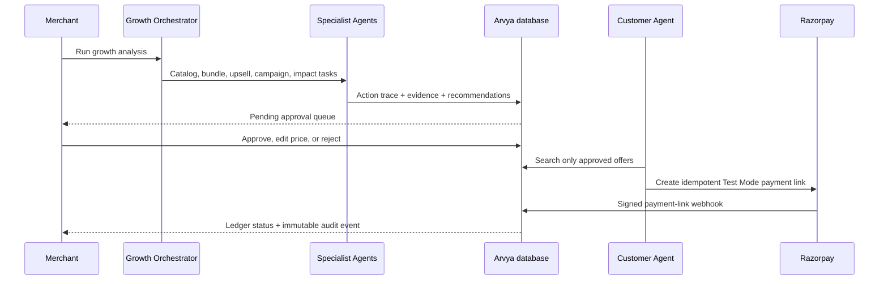
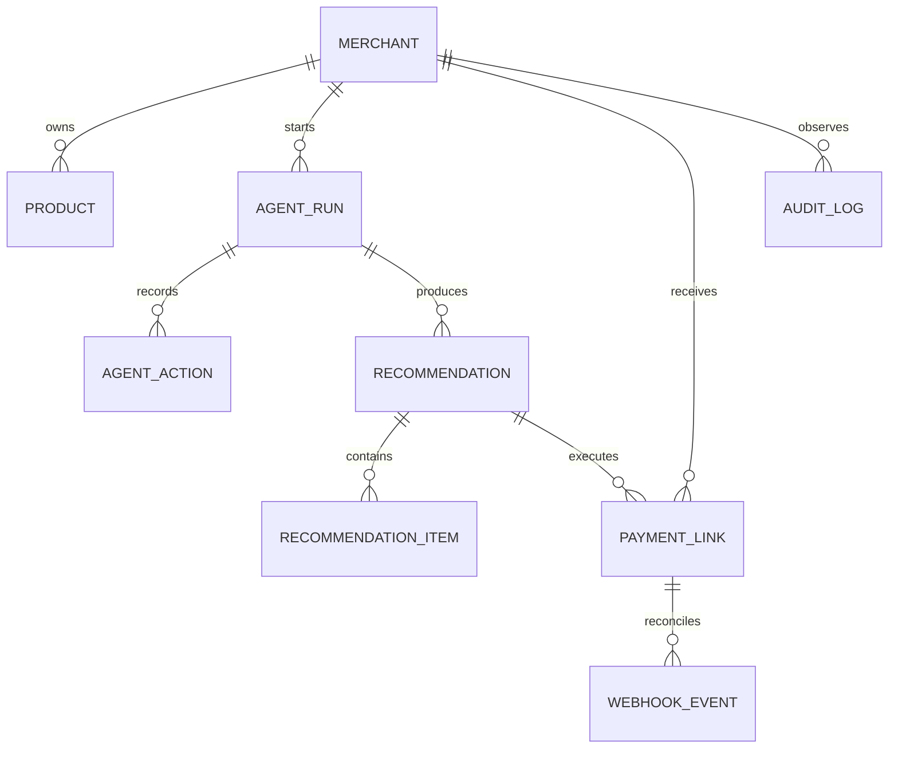

# Architecture

## Core decision

Arvya separates **recommendation** from **execution**. An agent may propose a commercial action, but only a merchant can approve it. The Customer Shopping Agent can access only the approved offer set, and the payment workflow validates its price again on the server.

## Agent workflow

## Trust boundaries

| Boundary | Protection |
|---|---|
| Agent → recommendation | Each specialist action records inputs, tools, output summary, and reasoning. |
| Recommendation → commerce | Merchant approval is required. Merchant edits cannot raise a bundle price above the original catalog total. |
| Customer → checkout | Customer sees only approved offers. Coupon eligibility and final amount are recomputed server-side. |
| Checkout → Razorpay | Payment links use an idempotency key per merchant, offer, customer, and coupon. |
| Razorpay → Arvya | Raw-body HMAC signature verification plus Razorpay event-ID deduplication. |
| Every state change | Audit log records actor, entity, detail, and timestamp. |

## Key data model

## Failure behavior

- **Insufficient usable catalog:** agent run returns a clear validation error; no recommendation is created.
- **Duplicate recommendation:** recommendation hash prevents pending/approved duplicates.
- **Merchant rejection:** recommendation is terminally rejected and remains in the audit record.
- **Razorpay link failure:** payment is marked `execution_failed`; no charge is attempted and a safe retry is available.
- **Duplicate webhook:** Razorpay event ID is recorded once; later delivery is acknowledged as a duplicate.
- **Unmatched webhook:** event is retained for investigation but never changes a local payment record.

## Production evolution

The current specialist workflow uses deterministic policy and catalog tools so its commercial guardrails are reproducible in a demo. The model-provider and prompt-version fields are intentionally stored per agent run, allowing a structured OpenAI- or Claude-compatible reasoning step to be introduced without changing approval, payment, or audit controls.
