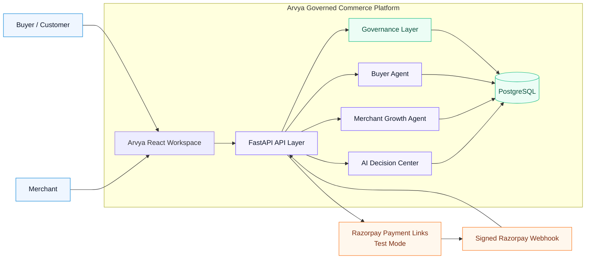
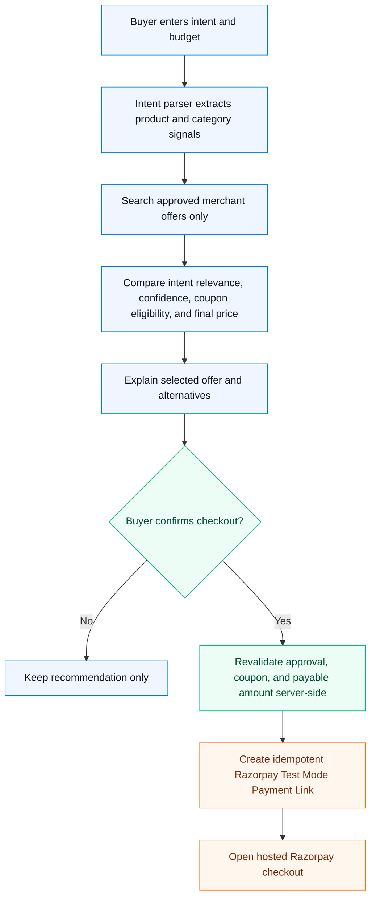
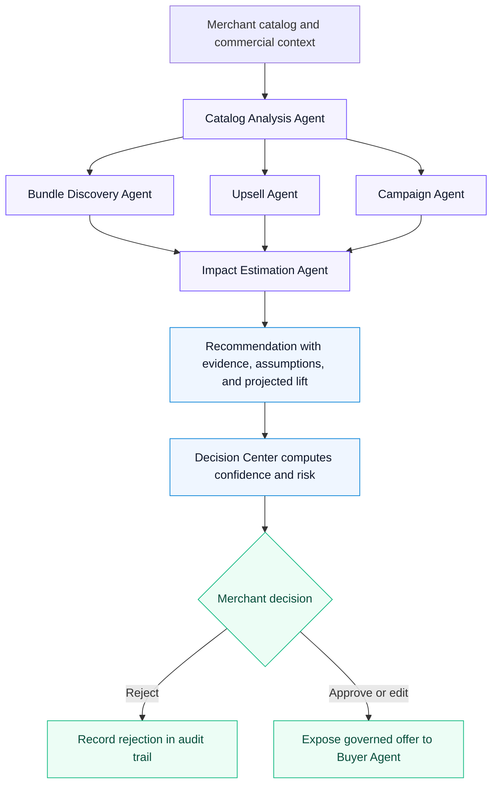
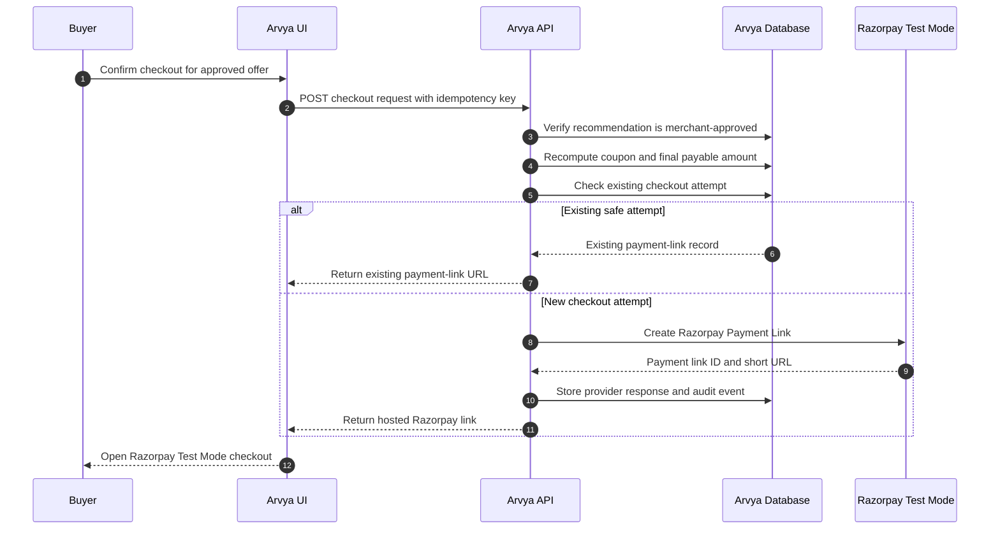
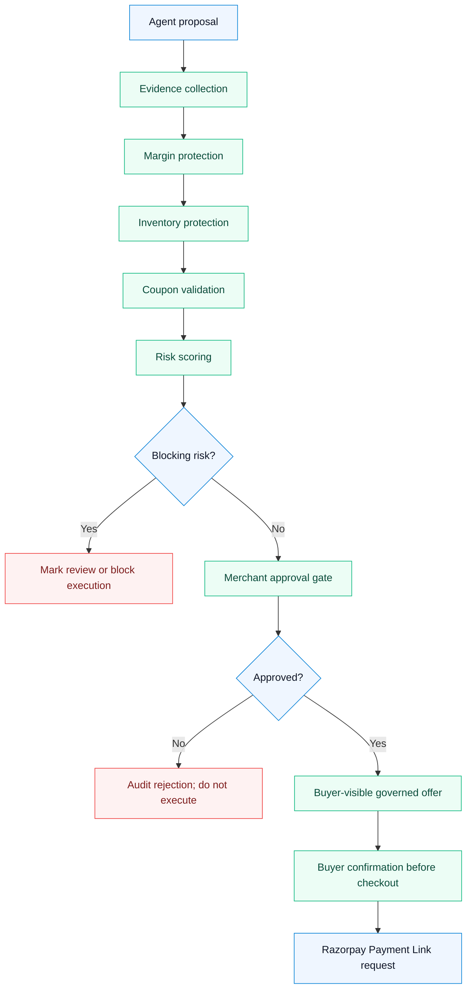
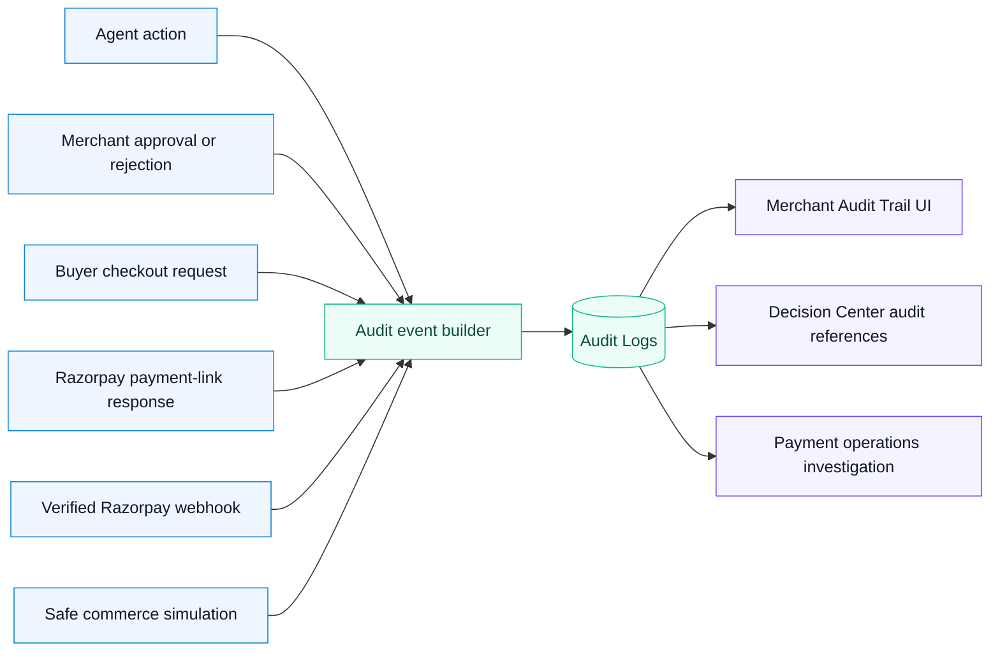
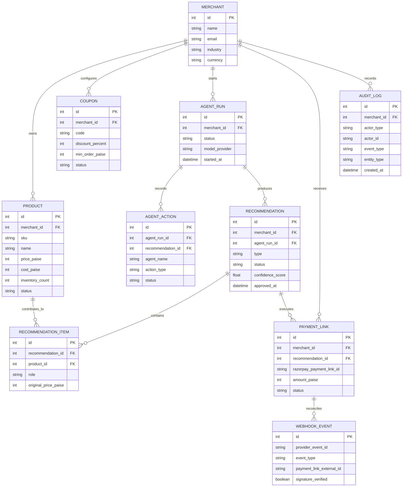
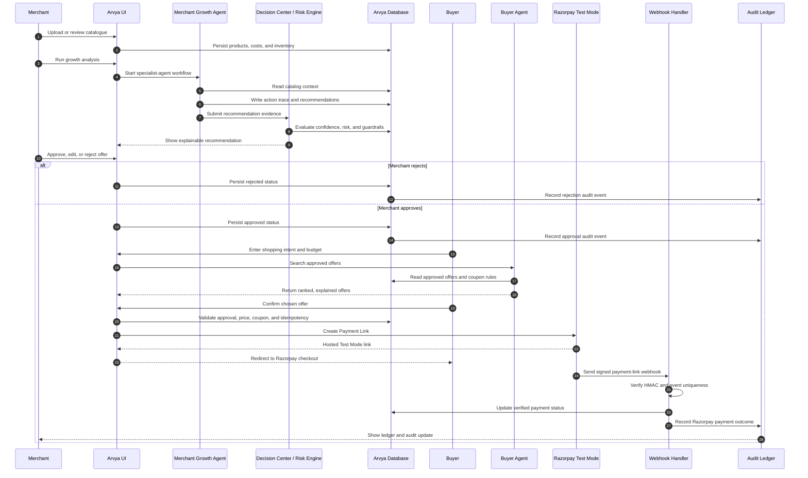

# Arvya Diagram Pack

> **Arvya — Where AI Buyers Meet AI Merchants.**
>
> These diagrams describe the governed commerce loop: agents propose and explain, merchants approve commercial actions, buyers confirm checkout, and Razorpay provides the verified payment outcome.

## 1. High-Level Architecture

## 2. Buyer Agent Workflow

## 3. Merchant Agent Workflow

## 4. Commerce Simulation Flow

```mermaid
flowchart LR
    A["1. Customer intent"] --> B["2. Buyer Agent"]
    B --> C["3. Catalog analysis"]
    C --> D["4. Offer discovery"]
    D --> E["5. Merchant evaluation"]
    E --> F["6. Bundle opportunity"]
    F --> G["7. Coupon validation"]
    G --> H["8. Risk check"]
    H --> I["9. Approval gate"]
    I --> J["10. Simulated payment-link step"]
    J --> K["11. Simulated payment-completion step"]
    K --> L["12. Simulated revenue outcome"]
    L --> M["13. Audit ledger update"]

    classDef live fill:#EFF6FF,stroke:#0B84D8,color:#0F172A
    classDef govern fill:#ECFDF5,stroke:#10B981,color:#064E3B
    classDef simulated fill:#FFF7ED,stroke:#F97316,color:#7C2D12
    class A,B,C,D,E,F,G live
    class H,I,M govern
    class J,K,L simulated
```

> Simulation mode is deliberately non-financial: it never creates a real Razorpay link, captures money, or changes live revenue metrics.

## 5. Payment Link Flow

## 6. Governance Flow

## 7. Approval Workflow

```mermaid
stateDiagram-v2
    [*] --> Draft: Agent creates recommendation
    Draft --> PendingApproval: Evidence and policy checks recorded
    PendingApproval --> Rejected: Merchant rejects recommendation
    PendingApproval --> Approved: Merchant approves proposed offer
    PendingApproval --> Approved: Merchant approves edited lower price
    Rejected --> [*]: Audit retained; no commercial execution
    Approved --> BuyerVisible: Buyer Agent can discover offer
    BuyerVisible --> CheckoutRequested: Buyer confirms checkout
    CheckoutRequested --> PaymentLinkCreated: Razorpay link created safely
    PaymentLinkCreated --> Paid: Verified signed webhook
    PaymentLinkCreated --> Failed: Provider failure, cancellation, or expiry
    Failed --> CheckoutRequested: Safe retry when eligible
    Paid --> [*]: Revenue and audit updated
```

## 8. Audit Trail Flow

## 9. Database ER Diagram

## 10. Complete End-to-End Sequence Diagram

---

## Suggested use in the Buildathon demo

1. Start with the **High-Level Architecture** diagram.
2. Use the **Merchant Agent Workflow** to establish commercial value.
3. Use the **Buyer Agent Workflow** to establish customer value.
4. Show the **Governance Flow** before discussing payments.
5. Finish with the **End-to-End Sequence Diagram** and then demonstrate the live UI.
